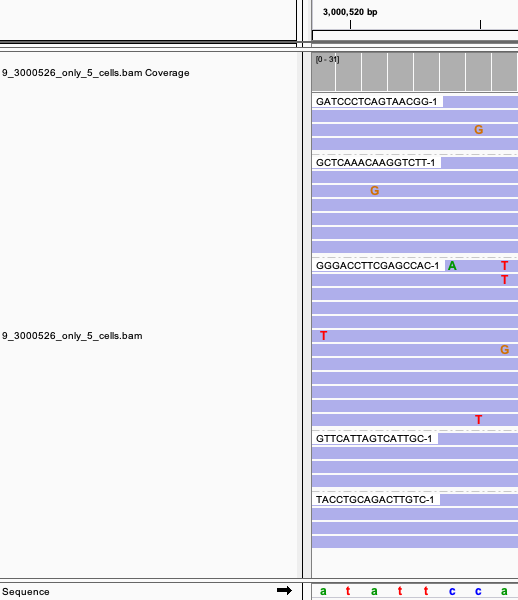

# MARINE: 
Multi-core Algorithm for Rapid Identification of Nucleotide Edits
------------------------------------------------------
MARINE relies on the MD tag being present in your .bam file. Some tools like STAR provide the option to add the MD tag during alignment, but otherwise you may have to add it after alignment. To add the MD tag and then index the processed bam, use the following samtools command templates:

```
samtools calmd -bAr input.bam reference_genome.fa > input.md.bam
samtools index input.md.bam
```

MARINE was developed and tested using Python 3.8.18 and is not guaranteed to work with earlier versions of Python.
Use the provided .yml file to create a new conda environment that contains all required dependencies, including the proper Python version, for MARINE:

```
conda env create  --file=marine_environment.yml
conda activate marine_environment
```

Notes:
* The more cores used, the faster MARINE will run
* Ensure that your annotation bedfile has the same chromosome nomenclature (e.g., "9" vs "chr9") as your bam
* The annotation file should be tab-separated and should have a standard bed column ordering, as follows:
```
1       29554   31109   MIR1302-2HG     lincRNA  +       
1       34554   36081   FAM138A         lincRNA  -       
1       65419   71585   OR4F5           protein_coding  +       
1       89295   133723  AL627309.1      lincRNA  -       
1       89551   91105   AL627309.3      lincRNA  -       
```

### Installation
Simply git clone this repository using the link at the top right on the main repository page. Should take at most a minute or two.

### Command parameters
```
usage: marine.py [-h] [--bam_filepath BAM_FILEPATH] [--annotation_bedfile_path ANNOTATION_BEDFILE_PATH] [--output_folder OUTPUT_FOLDER]
                 [--barcode_whitelist_file BARCODE_WHITELIST_FILE] [--cores CORES] [--reverse_stranded] [--coverage] [--filtering] [--annotation]
                 [--barcode_tag BARCODE_TAG] [--min_dist_from_end MIN_DIST_FROM_END] [--min_base_quality MIN_BASE_QUALITY] [--contigs CONTIGS]
                 [--min_read_quality MIN_READ_QUALITY] [--sailor] [--verbose] [--paired_end] [--max_edits_per_read MAX_EDITS_PER_READ]
                 [--num_intervals_per_contig NUM_INTERVALS_PER_CONTIG]

Run MARINE

optional arguments:
  -h, --help            show this help message and exit
  --bam_filepath BAM_FILEPATH
  --annotation_bedfile_path ANNOTATION_BEDFILE_PATH
  --output_folder OUTPUT_FOLDER
  --barcode_whitelist_file BARCODE_WHITELIST_FILE
  --cores CORES
  --reverse_stranded
  --coverage
  --filtering
  --annotation
  --barcode_tag BARCODE_TAG
  --min_dist_from_end MIN_DIST_FROM_END
  --min_base_quality MIN_BASE_QUALITY
  --contigs CONTIGS
  --min_read_quality MIN_READ_QUALITY
  --sailor
  --verbose
  --paired_end
  --max_edits_per_read MAX_EDITS_PER_READ
  --num_intervals_per_contig NUM_INTERVALS_PER_CONTIG
```

# Example commands below are drawn from files in the "examples" folder

The examples should take no more than a few minutes to run, especially if multiple CPUs are avilable for use (and specified using the --cores arugment). MARINE was developed and tested in Linux running on x86_64 but should work without any special hardware. Please let us know if you encounter any problems by creating a GitHub issue in this repository.

Expected example outputs are contained in the subfolders in the examples folder.

## Single-cell example MARINE command
MARINE will calculate edits and coverage on a per-cell basis. For example, the G at position 3000525 occurs in a region in the cell with the barcode ending in CGG-1, which only has 4 reads at that location. Meanwhile, the T at this position occurs instead in the cell with barcode ending in CAC-1 with 12 reads. These cell-specific edit counts and coverages will be reflected in MARINE outputs.



```
python marine.py \
--bam_filepath examples/data/single_cell_CT.md.subset.bam \
--output_folder examples/sc_subset_CT \
--barcode_whitelist_file examples/data/sc_barcodes.tsv.gz \
--barcode_tag "CB" \
--num_intervals_per_contig 16
```

## Single-cell long read (PacBio) example MARINE command
MARINE can be used to calculate edits and coverage on a per-cell and per-isoform basis after certain pre-processing steps are taken. Reads can be quantified and assigned to annotated isoforms using IsoQuant (v3.3.0) with parameters: --data-type pacbio, --transcript_quantification unique_only, and --gene_quantification unique_only. The read assignment output from IsoQuant can be used to add an isoform tag for each read, indicating the isoform to which it was assigned. Furthermore, the cell barcode can be concatenated to the isoform in a new tag called "IB", as shown in the IGV screenshot below (grouping labels refer to this tag in this case). Note that a suffix has been added to each IB tag reflecting the ending of both the isoform ID and the cell barcodes, which is used for efficiently calculating coverage only within each appropriate subset of isoform and cell-specific reads.


```
python marine.py \
--bam_filepath examples/data/LR_single_cell.md.subset.filtered.sorted.bam \
--output_folder examples/sc_lr_subset_CT \
--barcode_whitelist_file examples/data/sc_lr_barcodes.tsv.gz \
--barcode_tag "IB" \
--num_intervals_per_contig 16
```

## Bulk (single-end) example MARINE command

```
python marine.py \
--bam_filepath examples/data/bulk_CT.md.subset.bam \
--output_folder examples/bulk_subset_CT \
--reverse_stranded \
--cores 16 \
--annotation_bedfile_path /annotations/hg38_gencode.v35.annotation.genes.bed \
--contigs "chr1"
```

## Bulk (paired-end) example MARINE command -- example not provided 
```
python marine.py \
--bam_filepath examples/data/bulk_CT.md.subset.bam \
--output_folder examples/bulk_subset_CT \
--cores 16 \
--annotation_bedfile_path /annotations/hg38_gencode.v35.annotation.genes.bed \
--contigs "chr1" \
--paired_end
```
